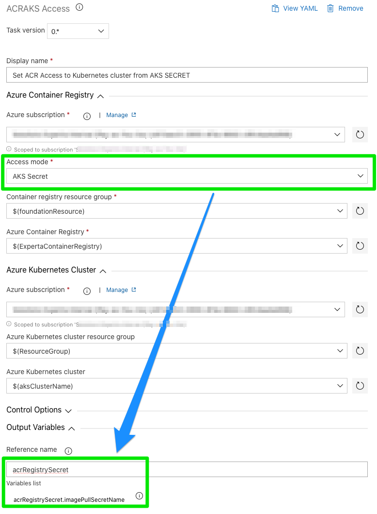
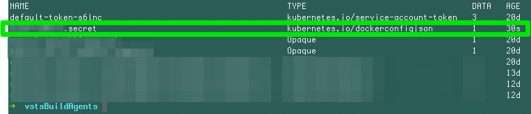

## Related Issues

- ### [Issue0001](https://github.com/expertasolutions/AzureContainerRegistryExtensions/issues/1)

  - **ACRACKAccess** task
    - Set the Azure Container Registry by linking access from a Kubernetes Secret. The secret generated will be accessible from task output variable *[referenceName]*.***imagePullSecretName*** under the name of ***[YOUR_CONTAINER_REGISTRY_NAME].secret***

      
      

    - Task is no longer set as ***preview***

  - **ACRCredentials** task
    - Task is no longer set as ***preview***