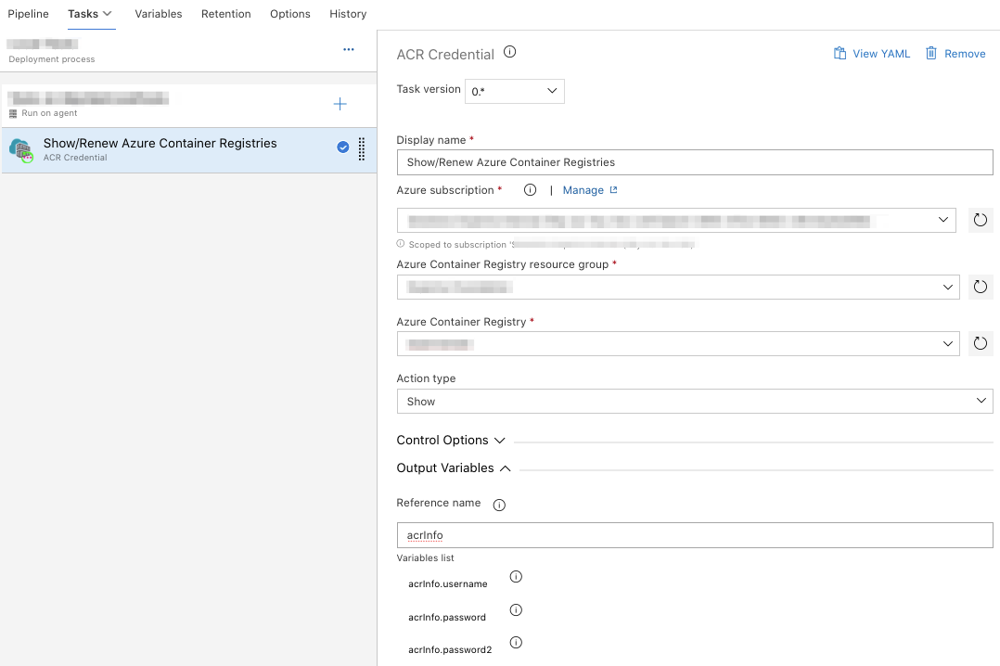
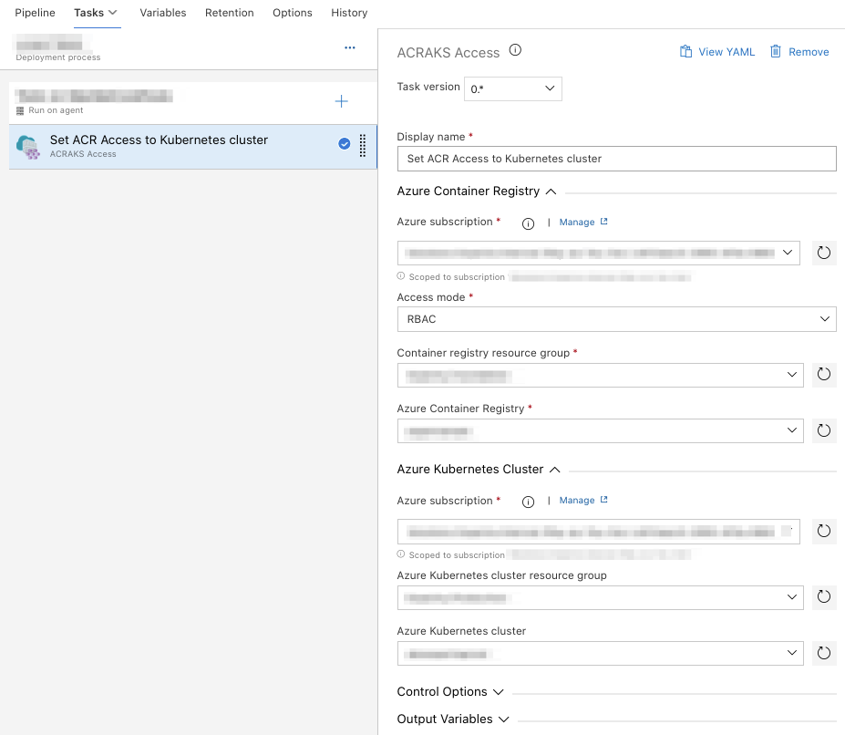

# Purpose & description
Tasks to help with the rights assignation between Azure Kubernetes Cluster instance and Azure Container Registry.

# Prerequisites to be used
The **Service Principal** used with your Azure Service Connection endpoint need to be 'Owner' of you **Azure subscription** where your **Azure Container Registry** is created.

# Tasks include

**NOTE**: ***AdminUser*** must be enable on your Azure Container Registry to used this task.

## ACRCredentials

#### Action Type
- Show: Get the current credentials information
- Renew: Renew the current credentials information access
#### Output variables
- username
- password
- password2

## ACRAKSAccess
