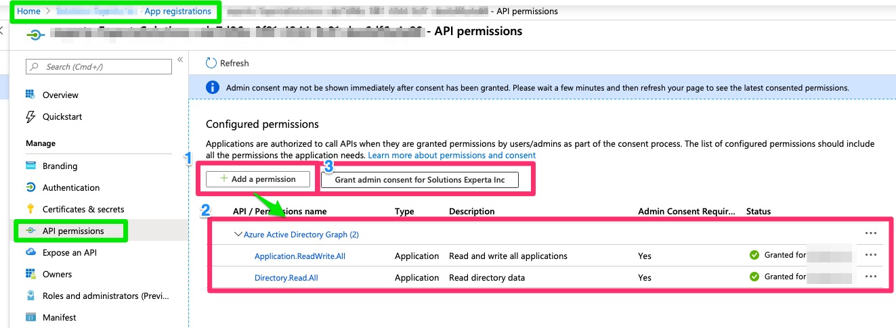

# Purpose & description
Tasks to help with the rights assignation between Azure Kubernetes Cluster instance and Azure Container Registry.

# Prerequisites to be used
The **Azure Resource Manager** endpoint used with these tasks in your Azure DevOps require to have the proper **API permissions**.

**1)** On the Azure Portal, you will find the **APP Registrations** option inside the **Azure Active Directory** sections
Select the App registration related to your AzureDevOps **Azure Resource Manager endpoint**.

**2)** Under that App registration, click on the option **API permissions** and add these ***API Permissions***
- Azure Active Directory Graph -> Application.ReadWrite.All
- Azure Active Directory Graph -> Directory.Read.All

**3)** Click on **Grant admin consent for [YOUR Azure AD Organization]** (ensure your are the Owner of the current app registration)

# Tasks include

## ACRCredentials

#### Action Type
- Show: Get the current credentials information
- Renew: Renew the current credentials information access
#### Output variables
- username
- password
- password2

## ACRAKSAccess
